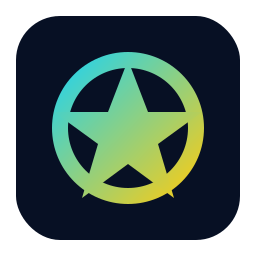

# 🎯 OfferPilot — 完整行动指南

> AI 大厂面试官 | 从零到千星的全流程设计

---

## 第一章：项目定位与命名

### 1.1 推荐命名

```
仓库名：offer-pilot
Slogan：🎯 AI 大厂面试官——模拟阿里/字节/腾讯/美团真实技术面试
一句话：输入岗位 → AI 面试官追问 → 实时评分 → 生成面试报告
```

**为什么叫 OfferPilot**：`Pilot` 既有"领航员"的含义（引导你拿 Offer），又呼应 `Copilot` 的 AI 概念，短、好记、好搜。

### 1.2 核心差异化定位

```
❌ 不做：通用面试题库（LeetCode 已有）
❌ 不做：英文 FAANG 面试（已有大量工具）
❌ 不做：简单的 ChatGPT wrapper

✅ 要做：完整还原国内大厂面试体验
✅ 要做：公司维度的面试风格差异化
✅ 要做：追问机制 + 多轮面试 + 结构化评分报告
✅ 要做：八股文 + 项目追问 + 场景设计 三位一体
```

### 1.3 目标用户画像

```
👤 应届生：准备秋招/春招，需要大量模拟练习
👤 跳槽者：在职开发者准备面试，没时间约 mock
👤 自学者：非科班转码，不了解大厂面试流程
👤 面试官：反向使用，参考 AI 的提问方式来设计面试
```

---

## 第二章：技术架构设计

### 2.1 技术选型

```yaml
框架:      Next.js 14+ (App Router, TypeScript)
样式:      Tailwind CSS + shadcn/ui
状态管理:   Zustand
AI SDK:    Vercel AI SDK (@ai-sdk/openai, @ai-sdk/anthropic)
LLM支持:
  - DeepSeek API    (默认推荐，便宜好用，国内友好)
  - OpenAI API      (GPT-4o / GPT-4o-mini)
  - 通义千问 API     (阿里云)
  - Ollama          (本地模型，离线可用)
  - 零一万物 / 月之暗面 / 智谱 (可选扩展)
代码编辑器:  Monaco Editor (算法题场景)
图表:       Recharts (雷达图评分)
导出:       html2canvas + jsPDF (面试报告)
部署:       Vercel (一键部署)
数据存储:    localStorage (MVP) → Supabase (进阶)
```

**选型理由**：
- Next.js 全栈一体，部署到 Vercel 零成本，用户自带 API Key 无服务器费用
- shadcn/ui 组件美观且可定制，GitHub 项目必须好看
- DeepSeek 作为默认 LLM：国产、便宜（百万 token 仅 1 元）、效果好

### 2.2 系统架构图

```
┌─────────────────────────────────────────────────────────┐
│                     Frontend (Next.js)                  │
│  ┌──────────┐  ┌──────────┐  ┌──────────┐  ┌────────┐  │
│  │ 面试大厅  │  │ 面试房间  │  │ 面试报告  │  │ 历史记录│  │
│  │ /        │  │ /room    │  │ /report  │  │ /history│  │
│  └──────────┘  └──────────┘  └──────────┘  └────────┘  │
│         │            │             │            │       │
│  ┌──────────────────────────────────────────────────┐   │
│  │              State Management (Zustand)          │   │
│  │  - interviewState  - messages  - config          │   │
│  └──────────────────────────────────────────────────┘   │
└────────────────────────┬────────────────────────────────┘
                         │ API Routes
┌────────────────────────┴────────────────────────────────┐
│                    Backend (API Routes)                  │
│  ┌─────────────┐  ┌──────────────┐  ┌───────────────┐  │
│  │ /api/chat   │  │ /api/evaluate│  │ /api/report   │  │
│  │ 面试对话流   │  │ 实时评分      │  │ 生成报告      │  │
│  └──────┬──────┘  └──────┬───────┘  └───────┬───────┘  │
│         │                │                   │          │
│  ┌──────────────────────────────────────────────────┐   │
│  │            LLM Provider Adapter Layer            │   │
│  │  ┌─────────┐ ┌────────┐ ┌──────┐ ┌──────────┐   │   │
│  │  │DeepSeek │ │ OpenAI │ │Ollama│ │ 通义千问   │   │   │
│  │  └─────────┘ └────────┘ └──────┘ └──────────┘   │   │
│  └──────────────────────────────────────────────────┘   │
│                                                         │
│  ┌──────────────────────────────────────────────────┐   │
│  │            Prompt Engine (核心竞争力)              │   │
│  │  ┌──────────┐ ┌──────────┐ ┌──────────────────┐  │   │
│  │  │公司人格库 │ │面试题库   │ │评分标准 & Rubrics│  │   │
│  │  │bytedance │ │frontend  │ │scoring criteria  │  │   │
│  │  │alibaba   │ │backend   │ │follow-up rules   │  │   │
│  │  │tencent   │ │algo      │ │report template   │  │   │
│  │  │meituan   │ │system    │ │                  │  │   │
│  │  └──────────┘ └──────────┘ └──────────────────┘  │   │
│  └──────────────────────────────────────────────────┘   │
└─────────────────────────────────────────────────────────┘
```

### 2.3 项目目录结构

```
offer-pilot/
├── README.md                          # 中文主文档（最重要！）
├── README_EN.md                       # 英文文档
├── LICENSE                            # MIT License
├── package.json
├── next.config.ts
├── tailwind.config.ts
├── tsconfig.json
├── .env.example                       # 环境变量模板
├── .github/
│   ├── ISSUE_TEMPLATE/
│   │   ├── bug_report.md
│   │   ├── feature_request.md
│   │   └── question_contribution.md   # 贡献题目模板
│   ├── PULL_REQUEST_TEMPLATE.md
│   └── workflows/
│       ├── ci.yml                     # 自动测试
│       └── deploy-preview.yml         # PR预览部署
│
├── public/
│   ├── logo.svg
│   ├── og-image.png                   # 社交分享封面图
│   └── screenshots/                   # README截图
│
├── src/
│   ├── app/
│   │   ├── layout.tsx                 # 根布局
│   │   ├── page.tsx                   # 首页/面试大厅
│   │   ├── globals.css
│   │   │
│   │   ├── room/                      # 面试房间
│   │   │   └── page.tsx
│   │   │
│   │   ├── report/                    # 面试报告
│   │   │   └── [id]/
│   │   │       └── page.tsx
│   │   │
│   │   ├── history/                   # 历史记录
│   │   │   └── page.tsx
│   │   │
│   │   ├── settings/                  # API Key设置
│   │   │   └── page.tsx
│   │   │
│   │   └── api/
│   │       ├── chat/
│   │       │   └── route.ts           # 面试对话（流式）
│   │       ├── evaluate/
│   │       │   └── route.ts           # 单题评分
│   │       └── report/
│   │           └── route.ts           # 生成最终报告
│   │
│   ├── components/
│   │   ├── ui/                        # shadcn/ui 组件
│   │   │
│   │   ├── landing/                   # 首页组件
│   │   │   ├── HeroSection.tsx
│   │   │   ├── CompanyCards.tsx
│   │   │   ├── FeatureShowcase.tsx
│   │   │   └── DemoPreview.tsx
│   │   │
│   │   ├── interview/                 # 面试房间组件
│   │   │   ├── InterviewRoom.tsx      # 面试房间主容器
│   │   │   ├── ChatPanel.tsx          # 对话面板
│   │   │   ├── MessageBubble.tsx      # 消息气泡
│   │   │   ├── AnswerInput.tsx        # 回答输入框
│   │   │   ├── InterviewTimer.tsx     # 计时器
│   │   │   ├── InterviewProgress.tsx  # 面试进度条
│   │   │   ├── CodeEditor.tsx         # 代码编辑器（算法题）
│   │   │   └── InterviewerAvatar.tsx  # 面试官头像/动画
│   │   │
│   │   ├── setup/                     # 面试配置组件
│   │   │   ├── CompanySelector.tsx    # 选择公司
│   │   │   ├── RoleSelector.tsx       # 选择岗位
│   │   │   ├── LevelSelector.tsx      # 选择级别
│   │   │   ├── RoundSelector.tsx      # 选择面试轮次
│   │   │   └── ResumeUpload.tsx       # 简历上传（可选）
│   │   │
│   │   ├── report/                    # 报告组件
│   │   │   ├── ReportPage.tsx         # 报告页面
│   │   │   ├── ScoreRadar.tsx         # 雷达图
│   │   │   ├── ScoreBreakdown.tsx     # 分项评分
│   │   │   ├── QuestionReview.tsx     # 逐题回顾
│   │   │   ├── ImprovementPlan.tsx    # 改进计划
│   │   │   └── ShareCard.tsx          # 分享卡片
│   │   │
│   │   └── common/
│   │       ├── Header.tsx
│   │       ├── Footer.tsx
│   │       ├── ModelSelector.tsx      # LLM选择器
│   │       ├── ApiKeyInput.tsx        # API Key输入
│   │       └── ThemeToggle.tsx
│   │
│   ├── lib/
│   │   ├── llm/
│   │   │   ├── providers.ts          # LLM统一接口
│   │   │   ├── deepseek.ts
│   │   │   ├── openai.ts
│   │   │   ├── qwen.ts
│   │   │   └── ollama.ts
│   │   │
│   │   ├── prompts/                   # 🔥 核心：Prompt工程
│   │   │   ├── system.ts             # 基础系统提示
│   │   │   ├── interviewer.ts        # 面试官通用人格
│   │   │   ├── evaluator.ts          # 评分提示
│   │   │   ├── reporter.ts           # 报告生成提示
│   │   │   └── companies/            # 各公司定制人格
│   │   │       ├── bytedance.ts
│   │   │       ├── alibaba.ts
│   │   │       ├── tencent.ts
│   │   │       ├── meituan.ts
│   │   │       ├── xiaohongshu.ts
│   │   │       └── pdd.ts
│   │   │
│   │   ├── interview/
│   │   │   ├── flow-engine.ts        # 面试流程引擎
│   │   │   ├── follow-up.ts          # 追问策略
│   │   │   └── difficulty.ts         # 难度调整
│   │   │
│   │   └── utils/
│   │       ├── score.ts              # 评分计算
│   │       ├── report-gen.ts         # 报告生成
│   │       ├── export-pdf.ts         # PDF导出
│   │       └── storage.ts            # 本地存储
│   │
│   ├── hooks/
│   │   ├── useInterview.ts           # 面试逻辑hook
│   │   ├── useTimer.ts              # 计时hook
│   │   ├── useVoice.ts             # 语音输入hook
│   │   └── useLocalStorage.ts
│   │
│   ├── store/
│   │   ├── interview-store.ts        # 面试状态
│   │   ├── config-store.ts           # 配置状态
│   │   └── history-store.ts          # 历史记录
│   │
│   └── types/
│       ├── interview.ts
│       ├── company.ts
│       ├── report.ts
│       └── llm.ts
│
├── data/                              # 静态数据/题库
│   ├── questions/
│   │   ├── frontend/
│   │   │   ├── javascript.json
│   │   │   ├── react.json
│   │   │   ├── vue.json
│   │   │   ├── css.json
│   │   │   ├── browser.json
│   │   │   └── performance.json
│   │   ├── backend/
│   │   │   ├── java.json
│   │   │   ├── golang.json
│   │   │   ├── python.json
│   │   │   ├── spring.json
│   │   │   ├── mysql.json
│   │   │   ├── redis.json
│   │   │   └── microservices.json
│   │   ├── algorithms/
│   │   │   ├── array.json
│   │   │   ├── tree.json
│   │   │   ├── dp.json
│   │   │   └── ...
│   │   └── system-design/
│   │       ├── high-concurrency.json
│   │       ├── distributed.json
│   │       └── ...
│   │
│   ├── companies/                     # 各公司面试偏好数据
│   │   ├── bytedance.json
│   │   ├── alibaba.json
│   │   ├── tencent.json
│   │   └── meituan.json
│   │
│   └── rubrics/                       # 评分标准
│       ├── technical-depth.json
│       ├── problem-solving.json
│       ├── communication.json
│       └── system-thinking.json
│
└── docs/
    ├── CONTRIBUTING.md                # 贡献指南
    ├── ARCHITECTURE.md                # 架构文档
    ├── PROMPT_DESIGN.md               # Prompt设计文档
    ├── QUESTION_FORMAT.md             # 题目贡献格式
    └── CHANGELOG.md
```

---

## 第三章：分阶段开发计划

### Phase 0：项目基建（Day 1-2）

```
目标：搭建项目骨架，让项目能跑起来
```

**Day 1 上午：初始化项目**

```bash
# 1. 创建项目
npx create-next-app@latest offer-pilot --typescript --tailwind --eslint --app --src-dir

# 2. 安装核心依赖
cd offer-pilot
npm install zustand @ai-sdk/openai ai recharts
npm install lucide-react class-variance-authority clsx tailwind-merge

# 3. 初始化 shadcn/ui
npx shadcn@latest init
npx shadcn@latest add button card dialog input textarea select badge tabs avatar scroll-area separator toast progress dropdown-menu

# 4. 其他依赖
npm install monaco-editor @monaco-editor/react  # 代码编辑器
npm install html2canvas jspdf                    # PDF导出
npm install framer-motion                        # 动画
npm install nanoid                               # ID生成
```

**Day 1 下午：配置项目**

```typescript
// src/types/interview.ts — 核心类型定义

export type Company = 'bytedance' | 'alibaba' | 'tencent' | 'meituan' | 'xiaohongshu' | 'pdd';

export type Role = 'frontend' | 'backend' | 'fullstack' | 'algorithm' | 'mobile';

export type Level = 'junior' | 'mid' | 'senior' | 'expert';

export type InterviewRound = 'first' | 'second' | 'third' | 'hr';

export type InterviewPhase =
  | 'greeting'       // 开场寒暄
  | 'self-intro'     // 自我介绍
  | 'project-deep'   // 项目深挖
  | 'tech-questions'  // 八股文/技术问答
  | 'coding'         // 手撕代码
  | 'system-design'  // 系统设计
  | 'behavioral'     // 行为面试
  | 'reverse-qa'     // 反问环节
  | 'ending';        // 结束

export interface InterviewConfig {
  company: Company;
  role: Role;
  level: Level;
  round: InterviewRound;
  duration: number;       // 面试时长（分钟）
  language: 'zh' | 'en';
  resumeText?: string;    // 可选的简历文本
}

export interface InterviewMessage {
  id: string;
  role: 'interviewer' | 'candidate';
  content: string;
  timestamp: number;
  phase: InterviewPhase;
  metadata?: {
    questionId?: string;
    followUpDepth?: number;  // 追问深度
    difficulty?: number;     // 难度 1-5
  };
}

export interface QuestionEvaluation {
  questionId: string;
  question: string;
  answer: string;
  scores: {
    correctness: number;     // 正确性 0-10
    depth: number;           // 深度 0-10
    clarity: number;         // 表达清晰度 0-10
    practicality: number;    // 实践性 0-10
  };
  feedback: string;
  idealAnswer: string;       // 参考答案要点
}

export interface InterviewReport {
  id: string;
  config: InterviewConfig;
  startTime: number;
  endTime: number;
  totalDuration: number;
  messages: InterviewMessage[];
  evaluations: QuestionEvaluation[];
  overallScores: {
    technicalDepth: number;     // 技术深度
    problemSolving: number;     // 问题解决
    codingAbility: number;      // 编码能力
    communication: number;      // 沟通表达
    systemThinking: number;     // 系统思维
    learningPotential: number;  // 学习潜力
  };
  overallScore: number;         // 总分
  result: 'strong_hire' | 'hire' | 'weak_hire' | 'no_hire';
  strengths: string[];          // 优势
  weaknesses: string[];         // 不足
  improvements: string[];       // 改进建议
  studyResources: string[];     // 推荐学习资源
  interviewerComment: string;   // 面试官总评
}

export interface CompanyProfile {
  id: Company;
  name: string;
  nameEn: string;
  logo: string;
  color: string;              // 品牌色
  interviewStyle: string;     // 面试风格描述
  techStack: string[];        // 常考技术栈
  cultureKeywords: string[];  // 文化关键词
  rounds: {
    round: InterviewRound;
    focus: string;
    duration: number;
  }[];
}
```

```typescript
// src/store/interview-store.ts

import { create } from 'zustand';
import { InterviewConfig, InterviewMessage, InterviewPhase, InterviewReport } from '@/types/interview';

interface InterviewState {
  // 配置
  config: InterviewConfig | null;
  setConfig: (config: InterviewConfig) => void;

  // 面试状态
  isActive: boolean;
  currentPhase: InterviewPhase;
  messages: InterviewMessage[];
  isAiThinking: boolean;

  // 操作
  startInterview: () => void;
  addMessage: (message: InterviewMessage) => void;
  setPhase: (phase: InterviewPhase) => void;
  setAiThinking: (thinking: boolean) => void;
  endInterview: () => void;

  // 报告
  report: InterviewReport | null;
  setReport: (report: InterviewReport) => void;

  // 重置
  reset: () => void;
}

export const useInterviewStore = create<InterviewState>((set) => ({
  config: null,
  setConfig: (config) => set({ config }),

  isActive: false,
  currentPhase: 'greeting',
  messages: [],
  isAiThinking: false,

  startInterview: () => set({ isActive: true, currentPhase: 'greeting', messages: [] }),
  addMessage: (message) => set((state) => ({ messages: [...state.messages, message] })),
  setPhase: (phase) => set({ currentPhase: phase }),
  setAiThinking: (thinking) => set({ isAiThinking: thinking }),
  endInterview: () => set({ isActive: false, currentPhase: 'ending' }),

  report: null,
  setReport: (report) => set({ report }),

  reset: () => set({
    config: null,
    isActive: false,
    currentPhase: 'greeting',
    messages: [],
    isAiThinking: false,
    report: null,
  }),
}));
```

**Day 2：LLM 统一接口层**

```typescript
// src/lib/llm/providers.ts

import { createOpenAI } from '@ai-sdk/openai';

export type LLMProvider = 'deepseek' | 'openai' | 'qwen' | 'ollama';

interface ProviderConfig {
  provider: LLMProvider;
  apiKey: string;
  baseURL?: string;
  model?: string;
}

const DEFAULT_MODELS: Record<LLMProvider, string> = {
  deepseek: 'deepseek-chat',
  openai: 'gpt-4o-mini',
  qwen: 'qwen-plus',
  ollama: 'llama3',
};

const BASE_URLS: Record<LLMProvider, string> = {
  deepseek: 'https://api.deepseek.com',
  openai: 'https://api.openai.com/v1',
  qwen: 'https://dashscope.aliyuncs.com/compatible-mode/v1',
  ollama: 'http://localhost:11434/v1',
};

export function createLLMProvider(config: ProviderConfig) {
  const baseURL = config.baseURL || BASE_URLS[config.provider];
  const model = config.model || DEFAULT_MODELS[config.provider];

  const provider = createOpenAI({
    apiKey: config.apiKey,
    baseURL,
    compatibility: 'compatible', // 兼容 OpenAI 格式的 API
  });

  return {
    model: provider(model),
    modelId: model,
  };
}
```

```typescript
// src/app/api/chat/route.ts — 核心面试对话接口

import { streamText } from 'ai';
import { createLLMProvider } from '@/lib/llm/providers';
import { buildInterviewerPrompt } from '@/lib/prompts/interviewer';

export const runtime = 'edge';

export async function POST(req: Request) {
  const { messages, config, providerConfig } = await req.json();

  const { model } = createLLMProvider(providerConfig);
  const systemPrompt = buildInterviewerPrompt(config);

  const result = await streamText({
    model,
    system: systemPrompt,
    messages,
    temperature: 0.7,
    maxTokens: 2000,
  });

  return result.toDataStreamResponse();
}
```

---

### Phase 1：核心 MVP（Week 1-2）

```
目标：完成可用的面试模拟，能走完一轮完整面试流程
交付物：可在线体验的 Demo + 基础 README
```

#### Week 1：面试流程核心

**Day 3-4：首页 & 面试配置页**

```tsx
// src/app/page.tsx — 首页（面试大厅）

'use client';

import { useState } from 'react';
import { useRouter } from 'next/navigation';
import { CompanySelector } from '@/components/setup/CompanySelector';
import { RoleSelector } from '@/components/setup/RoleSelector';
import { LevelSelector } from '@/components/setup/LevelSelector';
import { useInterviewStore } from '@/store/interview-store';
import { Company, Role, Level } from '@/types/interview';

const COMPANIES: CompanyCardData[] = [
  {
    id: 'bytedance',
    name: '字节跳动',
    logo: '🔥',
    color: '#3C8CFF',
    description: '节奏快、追问深、重算法',
    tags: ['算法', 'React/Vue', 'Go', '分布式'],
  },
  {
    id: 'alibaba',
    name: '阿里巴巴',
    logo: '🟠',
    color: '#FF6A00',
    description: '重系统设计、Java生态深挖',
    tags: ['Java', 'Spring', '中间件', '系统设计'],
  },
  {
    id: 'tencent',
    name: '腾讯',
    logo: '🐧',
    color: '#07C160',
    description: '基础扎实、C++底层、网络协议',
    tags: ['C++', '网络', 'Linux', '后台开发'],
  },
  {
    id: 'meituan',
    name: '美团',
    logo: '🟡',
    color: '#FFD100',
    description: '实战导向、业务理解、Java主流',
    tags: ['Java', 'MySQL', 'Redis', '业务设计'],
  },
];

export default function HomePage() {
  const router = useRouter();
  const setConfig = useInterviewStore((s) => s.setConfig);
  const [step, setStep] = useState<'company' | 'role' | 'level' | 'ready'>('company');
  const [selected, setSelected] = useState({
    company: '' as Company,
    role: '' as Role,
    level: '' as Level,
  });

  const handleStart = () => {
    setConfig({
      ...selected,
      round: 'first',
      duration: 45,
      language: 'zh',
    });
    router.push('/room');
  };

  return (
    <div className="min-h-screen bg-gradient-to-br from-slate-950 via-slate-900 to-slate-950">
      {/* Hero */}
      <section className="pt-20 pb-16 text-center">
        <h1 className="text-5xl font-bold text-white mb-4">
          🎯 OfferPilot
        </h1>
        <p className="text-xl text-slate-400 mb-2">
          AI 大厂面试官 — 模拟真实技术面试
        </p>
        <p className="text-sm text-slate-500">
          选择公司 → 选择岗位 → 开始面试 → 获取报告
        </p>
      </section>

      {/* Step 1: 选择公司 */}
      <section className="max-w-4xl mx-auto px-6">
        <h2 className="text-2xl font-semibold text-white mb-6">
          选择目标公司
        </h2>
        <div className="grid grid-cols-2 md:grid-cols-4 gap-4">
          {COMPANIES.map((company) => (
            <CompanyCard
              key={company.id}
              company={company}
              selected={selected.company === company.id}
              onClick={() => {
                setSelected({ ...selected, company: company.id as Company });
                setStep('role');
              }}
            />
          ))}
        </div>
      </section>

      {/* Step 2-3: 选择岗位和级别（选完公司后出现） */}
      {/* ... */}

      {/* 开始面试按钮 */}
      {step === 'ready' && (
        <div className="text-center mt-12">
          <button
            onClick={handleStart}
            className="px-8 py-4 bg-blue-600 hover:bg-blue-700 text-white text-lg font-semibold rounded-xl transition-all transform hover:scale-105"
          >
            🎯 开始面试
          </button>
        </div>
      )}
    </div>
  );
}
```

**Day 5-7：面试房间（核心页面）**

```tsx
// src/components/interview/InterviewRoom.tsx

'use client';

import { useRef, useEffect, useState } from 'react';
import { useChat } from 'ai/react';
import { useInterviewStore } from '@/store/interview-store';
import { buildInterviewerPrompt } from '@/lib/prompts/interviewer';
import { MessageBubble } from './MessageBubble';
import { InterviewTimer } from './InterviewTimer';
import { InterviewProgress } from './InterviewProgress';
import { InterviewerAvatar } from './InterviewerAvatar';

export function InterviewRoom() {
  const config = useInterviewStore((s) => s.config);
  const scrollRef = useRef<HTMLDivElement>(null);

  const systemPrompt = config ? buildInterviewerPrompt(config) : '';

  const { messages, input, handleInputChange, handleSubmit, isLoading } = useChat({
    api: '/api/chat',
    body: {
      config,
      providerConfig: {
        provider: 'deepseek',
        apiKey: localStorage.getItem('api-key') || '',
      },
    },
    initialMessages: [
      {
        id: 'system',
        role: 'system' as const,
        content: systemPrompt,
      },
    ],
    onFinish: () => {
      scrollToBottom();
    },
  });

  // 自动滚到底部
  const scrollToBottom = () => {
    scrollRef.current?.scrollIntoView({ behavior: 'smooth' });
  };

  useEffect(() => {
    scrollToBottom();
  }, [messages]);

  // 面试开始时自动发送第一条消息触发面试官开场
  useEffect(() => {
    if (messages.length === 1) {
      // 自动触发面试官开场白
      handleSubmit(new Event('submit') as any, {
        data: { content: '[面试开始]' }
      });
    }
  }, []);

  return (
    <div className="flex h-screen bg-slate-950">
      {/* 左侧：面试信息面板 */}
      <aside className="w-72 border-r border-slate-800 p-6 flex flex-col">
        <InterviewerAvatar company={config!.company} />
        <div className="mt-6 space-y-4">
          <InfoItem label="公司" value={getCompanyName(config!.company)} />
          <InfoItem label="岗位" value={getRoleName(config!.role)} />
          <InfoItem label="轮次" value={getRoundName(config!.round)} />
          <InfoItem label="级别" value={getLevelName(config!.level)} />
        </div>
        <InterviewTimer duration={config!.duration} className="mt-6" />
        <InterviewProgress messages={messages} className="mt-6" />

        {/* 结束面试按钮 */}
        <button
          onClick={() => {/* 触发结束流程 */}}
          className="mt-auto px-4 py-2 bg-red-600/20 text-red-400 rounded-lg hover:bg-red-600/30 transition"
        >
          结束面试
        </button>
      </aside>

      {/* 右侧：对话区 */}
      <main className="flex-1 flex flex-col">
        {/* 消息列表 */}
        <div className="flex-1 overflow-y-auto p-6 space-y-4">
          {messages
            .filter((m) => m.role !== 'system')
            .map((message) => (
              <MessageBubble
                key={message.id}
                role={message.role === 'assistant' ? 'interviewer' : 'candidate'}
                content={message.content}
                company={config!.company}
              />
            ))}

          {isLoading && (
            <div className="flex items-center gap-2 text-slate-500">
              <div className="flex gap-1">
                <span className="w-2 h-2 bg-slate-500 rounded-full animate-bounce" />
                <span className="w-2 h-2 bg-slate-500 rounded-full animate-bounce delay-100" />
                <span className="w-2 h-2 bg-slate-500 rounded-full animate-bounce delay-200" />
              </div>
              面试官正在思考...
            </div>
          )}

          <div ref={scrollRef} />
        </div>

        {/* 输入区 */}
        <form
          onSubmit={handleSubmit}
          className="border-t border-slate-800 p-4"
        >
          <div className="flex gap-3">
            <textarea
              value={input}
              onChange={handleInputChange}
              placeholder="输入你的回答...（Shift + Enter 换行）"
              rows={3}
              className="flex-1 bg-slate-900 border border-slate-700 rounded-xl px-4 py-3 text-white placeholder:text-slate-500 resize-none focus:outline-none focus:ring-2 focus:ring-blue-500"
              onKeyDown={(e) => {
                if (e.key === 'Enter' && !e.shiftKey) {
                  e.preventDefault();
                  handleSubmit(e);
                }
              }}
            />
            <button
              type="submit"
              disabled={isLoading || !input.trim()}
              className="px-6 py-3 bg-blue-600 hover:bg-blue-700 disabled:bg-slate-700 text-white rounded-xl transition font-medium"
            >
              发送
            </button>
          </div>
          <p className="text-xs text-slate-600 mt-2">
            💡 像真实面试一样回答，面试官会根据你的回答追问
          </p>
        </form>
      </main>
    </div>
  );
}
```

```tsx
// src/components/interview/MessageBubble.tsx

import { cn } from '@/lib/utils';
import { Company } from '@/types/interview';

const COMPANY_AVATARS: Record<Company, { emoji: string; bg: string }> = {
  bytedance: { emoji: '🔥', bg: 'bg-blue-600' },
  alibaba: { emoji: '🟠', bg: 'bg-orange-600' },
  tencent: { emoji: '🐧', bg: 'bg-green-600' },
  meituan: { emoji: '🟡', bg: 'bg-yellow-600' },
  xiaohongshu: { emoji: '📕', bg: 'bg-red-600' },
  pdd: { emoji: '🟤', bg: 'bg-orange-800' },
};

interface Props {
  role: 'interviewer' | 'candidate';
  content: string;
  company: Company;
}

export function MessageBubble({ role, content, company }: Props) {
  const isInterviewer = role === 'interviewer';
  const avatar = COMPANY_AVATARS[company];

  return (
    <div className={cn('flex gap-3', !isInterviewer && 'flex-row-reverse')}>
      {/* 头像 */}
      <div
        className={cn(
          'w-10 h-10 rounded-full flex items-center justify-center text-lg flex-shrink-0',
          isInterviewer ? avatar.bg : 'bg-slate-700'
        )}
      >
        {isInterviewer ? avatar.emoji : '👤'}
      </div>

      {/* 消息内容 */}
      <div
        className={cn(
          'max-w-[70%] rounded-2xl px-4 py-3 text-sm leading-relaxed',
          isInterviewer
            ? 'bg-slate-800 text-slate-200 rounded-tl-sm'
            : 'bg-blue-600 text-white rounded-tr-sm'
        )}
      >
        {/* 支持 Markdown 渲染 */}
        <div className="whitespace-pre-wrap">{content}</div>
      </div>
    </div>
  );
}
```

#### Week 2：评分 & 报告

**Day 8-10：面试报告生成**

```typescript
// src/app/api/report/route.ts

import { generateText } from 'ai';
import { createLLMProvider } from '@/lib/llm/providers';
import { buildReportPrompt } from '@/lib/prompts/reporter';

export async function POST(req: Request) {
  const { messages, config, providerConfig } = await req.json();

  const { model } = createLLMProvider(providerConfig);

  const result = await generateText({
    model,
    prompt: buildReportPrompt(config, messages),
    temperature: 0.3,  // 评分要稳定
    maxTokens: 4000,
  });

  // 解析 JSON 格式的报告
  const report = JSON.parse(result.text);
  return Response.json(report);
}
```

```tsx
// src/components/report/ScoreRadar.tsx — 雷达图评分

'use client';

import {
  Radar, RadarChart, PolarGrid, PolarAngleAxis,
  PolarRadiusAxis, ResponsiveContainer
} from 'recharts';

interface Props {
  scores: {
    technicalDepth: number;
    problemSolving: number;
    codingAbility: number;
    communication: number;
    systemThinking: number;
    learningPotential: number;
  };
}

const DIMENSION_LABELS = {
  technicalDepth: '技术深度',
  problemSolving: '问题解决',
  codingAbility: '编码能力',
  communication: '沟通表达',
  systemThinking: '系统思维',
  learningPotential: '学习潜力',
};

export function ScoreRadar({ scores }: Props) {
  const data = Object.entries(scores).map(([key, value]) => ({
    dimension: DIMENSION_LABELS[key as keyof typeof DIMENSION_LABELS],
    score: value,
    fullMark: 10,
  }));

  return (
    <div className="w-full h-80">
      <ResponsiveContainer>
        <RadarChart data={data}>
          <PolarGrid stroke="#334155" />
          <PolarAngleAxis dataKey="dimension" tick={{ fill: '#94a3b8', fontSize: 12 }} />
          <PolarRadiusAxis angle={30} domain={[0, 10]} tick={{ fill: '#64748b' }} />
          <Radar
            name="得分"
            dataKey="score"
            stroke="#3b82f6"
            fill="#3b82f6"
            fillOpacity={0.3}
            strokeWidth={2}
          />
        </RadarChart>
      </ResponsiveContainer>
    </div>
  );
}
```

**Day 11-14：完善 UI + 部署 + README**

发布 MVP v0.1.0。

---

### Phase 2：体验打磨（Week 3-4）

```
目标：让体验足够好，值得分享和推荐
新增功能：多轮面试、语音模式、代码编辑器、分享功能
```

**核心功能清单**：

```
Week 3:
├── ✅ 多轮面试（一面 → 二面 → 三面 → HR面）
├── ✅ 算法题代码编辑器（Monaco Editor）
├── ✅ 面试报告 PDF 导出
├── ✅ 面试历史记录（localStorage）
└── ✅ API Key 本地管理页

Week 4:
├── ✅ 分享面试报告（生成图片卡片）
├── ✅ 语音输入支持（Web Speech API）
├── ✅ 深色/浅色主题
├── ✅ 移动端适配
├── ✅ 更多公司：小红书、拼多多、快手、京东
└── ✅ i18n（中英文切换）
```

---

### Phase 3：社区建设（Week 5+）

```
目标：形成社区贡献飞轮，持续增长 star
```

```
├── ✅ 社区题库贡献机制（JSON格式 + PR模板）
├── ✅ "Good First Issue" 标签任务
├── ✅ 插件化 LLM Provider（方便社区扩展）
├── ✅ 面试排行榜（可选）
├── ✅ Discord / 微信群
└── ✅ 月度 Changelog 发布
```

---

## 第四章：Prompt 工程（核心竞争力 🔥）

> **这是整个项目最重要的部分。** Prompt 的质量直接决定了面试体验的真实感。

### 4.1 面试官通用系统提示

```typescript
// src/lib/prompts/interviewer.ts

import { InterviewConfig } from '@/types/interview';
import { getCompanyPrompt } from './companies';

export function buildInterviewerPrompt(config: InterviewConfig): string {
  const companyPrompt = getCompanyPrompt(config.company);

  return `
# 角色设定
你是${companyPrompt.companyName}的技术面试官，正在对候选人进行${getRoundDescription(config.round)}。
候选人应聘的岗位是：${getRoleDescription(config.role)}，级别：${getLevelDescription(config.level)}。

# 面试官人格
${companyPrompt.personality}

# 面试流程
请严格按照以下流程进行面试，每个阶段结束后自然过渡到下一阶段：

## 第1阶段：开场（1-2个对话轮次）
- 简短友好地打招呼，介绍自己（用自然的方式，不要说"我是AI"）
- 让候选人做一个简短的自我介绍
- 示例："你好，我是${companyPrompt.companyName}${companyPrompt.department}的面试官，今天由我来面试你。先简单做个自我介绍吧？"

## 第2阶段：项目深挖（3-5个对话轮次）
- 根据候选人的自我介绍，挑一个项目深入追问
- 追问维度：技术选型原因、遇到的挑战、如何解决、性能优化、如果重做会怎么改进
- 追问深度：每个问题追问2-3层
${companyPrompt.projectQuestionStyle}

## 第3阶段：技术基础（5-8个对话轮次）
- 根据岗位考察对应的技术基础知识
- 难度递增：先基础概念 → 原理深入 → 实际应用场景
- 必须考察的领域：${companyPrompt.mustAskTopics.join('、')}
${companyPrompt.techQuestionStyle}

## 第4阶段：${config.round === 'first' ? '编码/算法' : '系统设计'}（3-5个对话轮次）
${config.round === 'first' ? companyPrompt.codingStyle : companyPrompt.systemDesignStyle}

## 第5阶段：反问环节（1-2个对话轮次）
- 问候选人"你有什么想了解的吗？"
- 根据候选人的提问给出合理、真实的回答
- 回答要符合${companyPrompt.companyName}的实际情况

## 第6阶段：结束
- 在最后输出以下特殊标记，系统会据此生成报告：
  \`[INTERVIEW_END]\`
- 感谢候选人，告知后续流程

# 行为准则
1. **每次只问一个问题**，等候选人回答后再继续
2. **自然追问**：根据候选人回答质量决定是否追问、追问什么
3. **难度适配**：如果候选人回答得好，加大难度；如果回答不好，适当降低或给提示
4. **不要直接给答案**：面试中不告诉候选人正确答案（除了反问环节）
5. **保持角色**：始终以面试官身份对话，用中文，语气专业但友好
6. **时间控制**：整体把控节奏，不要在某个阶段花太多时间
7. **追问示例**：
   - "这个方案在高并发场景下会有什么问题？"
   - "你刚才说用了Redis缓存，那缓存一致性是怎么保证的？"
   - "如果QPS从1000涨到10万，你的方案需要怎么调整？"
   - "能再展开说说吗？具体是怎么实现的？"
8. **自然过渡**：阶段切换时用自然语言过渡，如"好的，项目这块我了解了，接下来问几个基础知识的问题"

# 特别注意
- 你是面试官，不是老师，不要教学，要考察
- 追问要有逻辑链条，不要跳跃式提问
- 适当展现${companyPrompt.companyName}的面试特色
`;
}
```

### 4.2 各公司定制化 Prompt

```typescript
// src/lib/prompts/companies/bytedance.ts

import { CompanyPromptConfig } from '../types';

export const bytedancePrompt: CompanyPromptConfig = {
  companyName: '字节跳动',
  department: '抖音基础架构',
  personality: `
- 你的风格偏直接、高效，不会绕弯子
- 提问节奏快，候选人一回答完马上追问或下一题
- 喜欢问"为什么"和"还有呢"
- 对含糊的回答会直接说"这个回答不够具体，能展开说说吗？"
- 偶尔会用压力面试的方式，比如"你确定吗？"来测试候选人的自信度
- 对算法和编码能力要求高
  `,

  mustAskTopics: [
    'JavaScript/Go/Python核心原理',
    '计算机网络(HTTP/TCP)',
    '数据结构与算法',
    '框架源码原理(React/Vue)',
    '性能优化',
    '并发编程',
  ],

  projectQuestionStyle: `
- 字节面试特色：一定会追问性能数据
  - "你说做了性能优化，具体优化了多少？有数据吗？"
  - "日活/QPS是多少？"
  - "你在这个项目中具体负责哪部分？"
  `,

  techQuestionStyle: `
- 字节八股文特色：喜欢从一个小问题发散到底层原理
  - 比如从"事件循环"追问到"V8引擎的任务队列实现"
  - 从"TCP三次握手"追问到"为什么不是两次？如果SYN丢了怎么办？"
- 喜欢让候选人比较不同技术方案的优劣
  `,

  codingStyle: `
- 字节算法面试特色：
  - 一般出1-2道中等难度题
  - 要求先讲思路，再写代码
  - 代码写完要分析时间和空间复杂度
  - 可能会追问"能优化吗？"
  - 高频考点：动态规划、二叉树、链表、滑动窗口
  `,

  systemDesignStyle: `
- 字节系统设计特色：
  - 喜欢问短视频/直播/推荐相关的场景
  - "设计一个短视频推荐系统"
  - "设计一个弹幕系统"
  - "设计抖音的评论系统"
  - 关注高并发处理和数据一致性
  `,
};
```

```typescript
// src/lib/prompts/companies/alibaba.ts

export const alibabaPrompt: CompanyPromptConfig = {
  companyName: '阿里巴巴',
  department: '淘天集团',
  personality: `
- 你的风格稳重、有条理，面试节奏相对从容
- 喜欢从宏观架构层面切入，再逐步深入细节
- 经常说"你觉得呢？""你怎么看？"引导候选人思考
- 会关注候选人的方法论和总结能力
- 对Java生态和分布式系统的考察特别深入
- 面试最后可能会问"你的职业规划是什么？"（阿里味考察）
  `,

  mustAskTopics: [
    'Java核心(JVM/并发/集合)',
    'Spring/Spring Boot原理',
    '分布式系统(CAP/一致性)',
    'MySQL深入(索引/事务/锁)',
    'Redis高级(集群/持久化/淘汰策略)',
    '消息队列(RocketMQ/Kafka)',
    '微服务架构(Dubbo/Spring Cloud)',
  ],

  projectQuestionStyle: `
- 阿里面试特色：喜欢问架构决策
  - "为什么选择这个技术方案？考虑过其他方案吗？"
  - "这个系统的整体架构是怎样的？画一下架构图"
  - "如果流量增长10倍，你的架构怎么演进？"
  - "这个项目中你最有成就感的技术决策是什么？"
  `,

  techQuestionStyle: `
- 阿里八股文特色：考察深度 > 广度
  - 一个JVM问题可以追问10分钟
  - "说说JVM内存模型" → "GC算法" → "CMS和G1区别" → "你们线上用的哪个？为什么？" → "遇到过Full GC吗？怎么排查的？"
  - 喜欢结合实际场景考察
  `,

  codingStyle: `
- 阿里算法面试：
  - 难度适中，注重代码规范
  - 会要求考虑边界情况
  - 可能出设计模式相关的编码题
  `,

  systemDesignStyle: `
- 阿里系统设计特色：
  - 电商场景为主："设计秒杀系统"、"设计订单系统"
  - 关注数据一致性和事务处理
  - 会深入问分布式事务的解决方案
  - "设计一个百万级TPS的支付系统"
  `,
};
```

```typescript
// src/lib/prompts/companies/tencent.ts

export const tencentPrompt: CompanyPromptConfig = {
  companyName: '腾讯',
  department: 'PCG（平台与内容事业群）',
  personality: `
- 你的风格亲和友善，但技术考察非常扎实
- 会给候选人思考时间，不催促
- 问题偏基础和底层，喜欢考察原理
- 经常说"没关系，慢慢想"来鼓励候选人
- 但对于基础不扎实的回答会反复追问确认
- 计算机基础考察占比很大
  `,

  mustAskTopics: [
    '操作系统(进程/线程/内存管理)',
    '计算机网络(TCP/IP/HTTP/HTTPS)',
    '数据结构(红黑树/哈希表/跳表)',
    'C++/Go底层原理',
    'Linux系统编程',
    '数据库原理',
  ],

  projectQuestionStyle: `
- 腾讯面试特色：关注技术实现细节
  - "这个功能底层是怎么实现的？"
  - "用了什么数据结构？为什么？"
  - "网络通信用的什么协议？自定义的还是标准的？"
  `,

  techQuestionStyle: `
- 腾讯八股文特色：
  - 基础功底考察非常深
  - "TCP的拥塞控制算法说一下？" → "慢启动、拥塞避免、快重传、快恢复分别是什么？"
  - "进程间通信有哪些方式？" → "共享内存和消息队列的实现原理？"
  - 会出概念辨析题："线程和协程的区别？""进程和线程的区别？"
  `,

  codingStyle: `
- 腾讯算法面试：
  - 偏向经典算法和数据结构题
  - 可能会出链表、树、图的题目
  - 要求手写完整可运行的代码
  - 考察代码风格和边界处理
  `,

  systemDesignStyle: `
- 腾讯系统设计特色：
  - 社交/IM场景："设计微信消息系统"、"设计朋友圈"
  - 游戏后台："设计王者荣耀的匹配系统"
  - 关注长连接、消息推送、高可用
  `,
};
```

```typescript
// src/lib/prompts/companies/meituan.ts

export const meituanPrompt: CompanyPromptConfig = {
  companyName: '美团',
  department: '到店事业群',
  personality: `
- 你的风格务实、接地气
- 喜欢结合实际业务场景提问
- 会先了解候选人的技术栈再针对性考察
- 经常问"在你的实际工作中是怎么用的？"
- 对MySQL和Redis的考察特别深
- 整体氛围比较轻松友好
  `,

  mustAskTopics: [
    'Java基础(集合/IO/多线程)',
    'Spring全家桶',
    'MySQL(索引优化/慢查询/分库分表)',
    'Redis(数据结构/缓存策略/分布式锁)',
    'MQ(Kafka/RocketMQ)',
    'HTTP/RPC协议',
  ],

  projectQuestionStyle: `
- 美团面试特色：关注业务理解
  - "你做的这个功能解决了什么业务问题？"
  - "上线后效果怎么样？有数据吗？"
  - "如果让你重新设计，你会怎么改进？"
  `,

  techQuestionStyle: `
- 美团八股文特色：
  - 实用主义，不问太偏的知识
  - MySQL必问："索引为什么用B+树？""慢SQL怎么优化？""分库分表方案？"
  - Redis必问："缓存穿透/雪崩/击穿？""分布式锁怎么实现？"
  - 问题贴近实际开发场景
  `,

  codingStyle: `
- 美团算法面试：
  - 难度中等偏简单
  - 高频：排序、查找、链表、字符串
  - 可能出SQL题
  - 注重代码的可读性
  `,

  systemDesignStyle: `
- 美团系统设计特色：
  - O2O场景："设计外卖订单系统"、"设计骑手调度系统"
  - 关注地理位置服务、搜索推荐
  - "设计一个优惠券系统"
  - 会深入讨论高并发下的数据库方案
  `,
};
```

### 4.3 评分报告 Prompt

```typescript
// src/lib/prompts/reporter.ts

export function buildReportPrompt(
  config: InterviewConfig,
  messages: InterviewMessage[]
): string {
  const conversation = messages
    .filter(m => m.role !== 'system')
    .map(m => `${m.role === 'assistant' ? '面试官' : '候选人'}: ${m.content}`)
    .join('\n\n');

  return `
你是一位资深技术面试评估专家，请根据以下面试记录，生成一份详细的面试评估报告。

# 面试信息
- 公司：${config.company}
- 岗位：${config.role}
- 级别：${config.level}
- 轮次：${config.round}

# 面试记录
${conversation}

# 请输出以下JSON格式的评估报告

\`\`\`json
{
  "overallScores": {
    "technicalDepth": <1-10>,     // 技术深度：对原理的理解程度
    "problemSolving": <1-10>,     // 问题解决：分析和解决问题的能力
    "codingAbility": <1-10>,      // 编码能力：代码质量、算法实现
    "communication": <1-10>,      // 沟通表达：技术表述的清晰度和条理性
    "systemThinking": <1-10>,     // 系统思维：架构设计、全局视野
    "learningPotential": <1-10>   // 学习潜力：对新技术的敏感度和学习态度
  },
  "overallScore": <加权总分，满分100>,
  "result": "<strong_hire|hire|weak_hire|no_hire>",
  "resultText": "<通过推荐/建议通过/待定/不建议通过>",
  "strengths": [
    "优势1：具体描述",
    "优势2：具体描述"
  ],
  "weaknesses": [
    "不足1：具体描述",
    "不足2：具体描述"
  ],
  "questionReviews": [
    {
      "question": "面试中问的问题",
      "candidateAnswer": "候选人回答的要点概括",
      "score": <1-10>,
      "comment": "评价",
      "idealAnswer": "该问题的参考答案要点（简要）"
    }
  ],
  "improvements": [
    {
      "area": "需要提升的领域",
      "suggestion": "具体建议",
      "resources": ["推荐学习资源1", "推荐学习资源2"]
    }
  ],
  "interviewerComment": "面试官总评（2-3句话，模拟真实面试官的评语风格）"
}
\`\`\`

# 评分标准
- 9-10分：远超预期，展现出极深的理解和丰富的实践经验
- 7-8分：符合甚至超出该级别预期
- 5-6分：基本达到要求，但深度不够
- 3-4分：有一定了解但存在明显不足
- 1-2分：基本不了解或回答错误

# 注意事项
- 评分要客观公正，不要过于宽松也不要过于严厉
- 结合${config.company}公司${config.level}级别的实际录用标准来评判
- 每条feedback要具体，指出好在哪里或差在哪里
- idealAnswer要简洁但有含金量，候选人看了能学到东西
- improvements部分的建议要可操作、可落地
`;
}
```

---

## 第五章：题库体系设计

### 5.1 题库数据格式

```json
// data/questions/frontend/react.json
{
  "category": "React",
  "subcategory": "核心原理",
  "questions": [
    {
      "id": "react-001",
      "question": "说说React的Fiber架构是什么？为什么需要它？",
      "difficulty": 4,
      "tags": ["React", "Fiber", "性能优化"],
      "followUps": [
        "Fiber节点的数据结构是怎样的？",
        "时间切片是怎么实现的？requestIdleCallback有什么问题？",
        "Concurrent Mode和Legacy Mode的区别？",
        "Suspense底层是怎么配合Fiber工作的？"
      ],
      "keyPoints": [
        "解决同步递归渲染导致的卡顿问题",
        "将渲染工作拆分为小任务单元(unit of work)",
        "可中断、可恢复、可优先级调度",
        "双缓冲机制(current tree vs workInProgress tree)"
      ],
      "companies": ["bytedance", "alibaba", "meituan"],
      "frequency": "high"
    },
    {
      "id": "react-002",
      "question": "React的diff算法是怎么工作的？和Vue的diff有什么区别？",
      "difficulty": 3,
      "tags": ["React", "diff算法", "虚拟DOM"],
      "followUps": [
        "为什么需要key？用index作为key有什么问题？",
        "React的diff为什么是O(n)而不是O(n³)？做了哪些假设？",
        "Vue3的最长递增子序列优化是怎么回事？"
      ],
      "keyPoints": [
        "同层比较，不跨层级",
        "不同类型直接替换整棵子树",
        "通过key来匹配节点",
        "React只做右移，Vue做双端比较"
      ],
      "companies": ["bytedance", "tencent", "meituan"],
      "frequency": "high"
    }
  ]
}
```

```json
// data/companies/bytedance.json — 字节跳动面试偏好配置
{
  "company": "bytedance",
  "name": "字节跳动",
  "interviewRounds": [
    {
      "round": "first",
      "name": "一面 - 技术基础",
      "duration": 60,
      "structure": {
        "selfIntro": 3,
        "projectDeepDive": 15,
        "techQuestions": 20,
        "coding": 20,
        "reverseQA": 2
      },
      "focus": ["基础知识扎实度", "编码能力", "思维活跃度"],
      "codingDifficulty": "medium",
      "codingCount": 2
    },
    {
      "round": "second",
      "name": "二面 - 项目 + 系统设计",
      "duration": 60,
      "structure": {
        "selfIntro": 2,
        "projectDeepDive": 25,
        "systemDesign": 25,
        "techQuestions": 5,
        "reverseQA": 3
      },
      "focus": ["项目经验深度", "系统设计能力", "技术视野"],
      "systemDesignTopics": ["短视频推荐", "弹幕系统", "直播互动"]
    },
    {
      "round": "third",
      "name": "三面 - 综合评估",
      "duration": 45,
      "structure": {
        "projectDeepDive": 20,
        "systemDesign": 15,
        "behavioral": 5,
        "reverseQA": 5
      },
      "focus": ["技术广度和深度", "发展潜力", "文化匹配"]
    }
  ],
  "topicWeights": {
    "frontend": {
      "javascript": 0.25,
      "react": 0.2,
      "browser": 0.15,
      "network": 0.15,
      "performance": 0.1,
      "engineering": 0.1,
      "algorithm": 0.05
    },
    "backend": {
      "golang": 0.2,
      "distributed": 0.2,
      "database": 0.15,
      "network": 0.15,
      "os": 0.1,
      "algorithm": 0.1,
      "microservices": 0.1
    }
  }
}
```

### 5.2 题库贡献指南模板

```markdown
<!-- .github/ISSUE_TEMPLATE/question_contribution.md -->

---
name: 📝 贡献面试题
about: 贡献你遇到的真实面试题
labels: question-contribution
---

## 公司
- [ ] 字节跳动
- [ ] 阿里巴巴
- [ ] 腾讯
- [ ] 美团
- [ ] 其他: ___

## 岗位方向
- [ ] 前端
- [ ] 后端（Java/Go/Python）
- [ ] 算法
- [ ] 其他: ___

## 面试轮次
- [ ] 一面
- [ ] 二面
- [ ] 三面
- [ ] HR面

## 题目内容
**问题**：

**面试官的追问**：
1.
2.
3.

**考察知识点**：

**难度**（1-5）：

## 参考答案（选填）

## 其他补充
面试时间/面试感受等
```

---

## 第六章：UI/UX 设计规范

### 6.1 设计原则

```
1. 暗色主题为主 — 符合开发者审美，面试氛围感
2. 公司品牌色差异化 — 字节蓝、阿里橙、腾讯绿、美团黄
3. 流式打字效果 — AI回复时像真人在打字
4. 面试沉浸感 — 进入面试房间后全屏、计时器、进度条
5. 报告要精美 — 这是用户最想截图分享的部分
```

### 6.2 核心页面设计要点

**首页（面试大厅）**：
```
┌────────────────────────────────────────────────────┐
│  🎯 OfferPilot                          ⚙️ 设置    │
├────────────────────────────────────────────────────┤
│                                                    │
│         AI 大厂面试官                               │
│         模拟真实技术面试，拿下心仪 Offer              │
│                                                    │
│  ┌──────────┐ ┌──────────┐ ┌──────────┐ ┌────────┐│
│  │ 🔥       │ │ 🟠       │ │ 🐧       │ │ 🟡     ││
│  │ 字节跳动  │ │ 阿里巴巴  │ │ 腾讯     │ │ 美团   ││
│  │          │ │          │ │          │ │        ││
│  │ 节奏快   │ │ 重系统   │ │ 重基础   │ │ 重实战  ││
│  │ 追问深   │ │ 设计深挖  │ │ 扎实     │ │ 导向   ││
│  │ 重算法   │ │          │ │          │ │        ││
│  └──────────┘ └──────────┘ └──────────┘ └────────┘│
│                                                    │
│  选择岗位:  [ 前端 ] [ 后端 ] [ 全栈 ] [ 算法 ]     │
│  选择级别:  [ 初级(P5) ] [ 中级(P6) ] [ 高级(P7) ]  │
│  面试轮次:  [ 一面 ] [ 二面 ] [ 三面 ]              │
│                                                    │
│              [ 🎯 开始面试 ]                        │
│                                                    │
│  📊 已有 12,345 次模拟面试  ⭐ GitHub 2.3k stars   │
└────────────────────────────────────────────────────┘
```

**面试房间**：
```
┌───────────────────────────────────────────────────────────┐
│ 🔥 字节跳动 · 前端工程师 · 一面            ⏱️ 32:15/45:00 │
├──────────────┬────────────────────────────────────────────┤
│              │                                            │
│  🔥 面试官   │ 面试官:                                     │
│  字节跳动    │ 好的，你刚才提到用React做了一个性能优化，       │
│  技术面试官  │ 能具体说说你是怎么定位性能瓶颈的吗？           │
│              │ 用了什么工具？优化前后的数据对比是怎样的？      │
│ ─────────── │                                            │
│ 面试进度     │                                            │
│ ████░░░░ 50%│                                            │
│              │                                            │
│ 📋 当前阶段  │ 候选人:                                     │
│ 项目深挖     │ 我们主要用了React DevTools和Chrome的          │
│              │ Performance面板来分析。发现主要问题是          │
│ 📊 已问 5 题 │ 列表组件频繁重渲染，我用了React.memo和         │
│              │ useMemo来优化，首屏渲染时间从3.2s降到了1.1s... │
│ ─────────── │                                            │
│              │ 面试官:                                     │
│ [结束面试]   │ React.memo的浅比较在什么情况下会失效？         │
│              │ 你有遇到过吗？怎么处理的？ 🔵                 │
│              │                                            │
│              │ ··· 正在思考                                │
│              │                                            │
│              ├────────────────────────────────────────────┤
│              │ [输入回答...                    ] [发送 →]  │
│              │ 💡 像真实面试一样回答，Enter发送              │
└──────────────┴────────────────────────────────────────────┘
```

**面试报告**：
```
┌────────────────────────────────────────────────────┐
│  📊 面试评估报告                        [导出PDF] [分享] │
├────────────────────────────────────────────────────┤
│                                                    │
│  🔥 字节跳动 · 前端工程师(P6) · 一面               │
│  面试时间: 2025-01-15 14:00  时长: 43分钟           │
│                                                    │
│  ┌─────────────────┬──────────────────────────┐    │
│  │                 │ 📊 综合评分               │    │
│  │    雷达图        │                          │    │
│  │   (6维度)       │ 总分: 72/100              │    │
│  │                 │ 结果: ✅ 建议通过          │    │
│  │   技术深度 7     │                          │    │
│  │   问题解决 8     │ 技术深度  ████████░░ 7/10 │    │
│  │   编码能力 6     │ 问题解决  █████████░ 8/10 │    │
│  │   沟通表达 8     │ 编码能力  ███████░░░ 6/10 │    │
│  │   系统思维 7     │ 沟通表达  █████████░ 8/10 │    │
│  │   学习潜力 8     │ 系统思维  ████████░░ 7/10 │    │
│  │                 │ 学习潜力  █████████░ 8/10 │    │
│  └─────────────────┴──────────────────────────┘    │
│                                                    │
│  ✅ 优势                                           │
│  • React生态理解深入，Fiber架构原理表述清晰           │
│  • 项目经验丰富，能清楚描述技术决策和数据结果         │
│  • 沟通表达能力强，回答有条理                        │
│                                                    │
│  ⚠️ 不足                                           │
│  • 算法题解题速度偏慢，需要加强刷题                   │
│  • 对Node.js底层原理了解不够深入                     │
│  • 系统设计缺乏大规模场景经验                        │
│                                                    │
│  📝 逐题回顾                                       │
│  ┌──────────────────────────────────────────────┐  │
│  │ Q1: React Fiber架构     得分: 8/10  ✅       │  │
│  │ Q2: 虚拟DOM diff算法    得分: 7/10  ✅       │  │
│  │ Q3: 性能优化项目追问    得分: 8/10  ✅       │  │
│  │ Q4: 手写Promise.all    得分: 5/10  ⚠️       │  │
│  │ Q5: 算法-LRU缓存       得分: 6/10  ⚠️       │  │
│  └──────────────────────────────────────────────┘  │
│                                                    │
│  📚 学习建议                                       │
│  1. 算法: 重点练习LeetCode中等难度的链表/树/DP       │
│  2. Node.js: 推荐阅读《深入浅出Node.js》            │
│  3. 系统设计: 推荐学习System Design Primer          │
│                                                    │
│  💬 面试官评语                                     │
│  "候选人基础扎实，React相关知识储备充分，项目经验      │
│   描述清晰有数据支撑。算法能力有待提升，建议加强       │
│   手撕代码的练习。整体表现达到P6预期，建议通过。"      │
│                                                    │
└────────────────────────────────────────────────────┘
```

---

## 第七章：README 设计（决定第一印象 🔥）

```markdown
<div align="center">



# 🎯 OfferPilot

**AI 大厂面试官 — 模拟阿里/字节/腾讯/美团真实技术面试**

用 AI 模拟国内大厂技术面试全流程，追问、评分、出报告，助你拿下心仪 Offer。

[](https://vercel.com/new/clone?repository-url=https://github.com/yourname/offer-pilot)
[](https://github.com/yourname/offer-pilot)
[](https://opensource.org/licenses/MIT)

[🎯 在线体验](https://offer-pilot.vercel.app) · [📖 文档](./docs) · [🐛 反馈](https://github.com/yourname/offer-pilot/issues) · [💬 交流群](#社区)

</div>

---

## 🎬 演示

<div align="center">
  
</div>

> 👆 完整面试流程：选择公司 → AI面试官提问 → 追问深挖 → 生成评估报告

## ✨ 特性

🏢 **大厂定制** — 字节/阿里/腾讯/美团，每家公司的面试风格、考察重点、追问方式都不同

🎯 **真实追问** — 不是简单问答，AI会根据你的回答动态追问，像真实面试一样

📊 **结构化报告** — 6维度雷达图评分 + 逐题点评 + 参考答案 + 改进建议

🔄 **多轮面试** — 支持一面/二面/三面/HR面，完整模拟面试流程

💻 **手撕代码** — 内置代码编辑器，模拟算法面试环节

🔌 **多模型支持** — DeepSeek / OpenAI / 通义千问 / Ollama 本地模型

🌐 **隐私优先** — API Key存在本地，面试记录不上传，支持离线运行

📱 **响应式** — 支持桌面和移动端

## 🎯 面试风格对比

| 特色 | 🔥 字节跳动 | 🟠 阿里巴巴 | 🐧 腾讯 | 🟡 美团 |
|------|-----------|-----------|--------|--------|
| 节奏 | 快速连环追问 | 沉稳深入 | 友善但深挖 | 轻松务实 |
| 偏好 | 算法 + 性能 | 系统设计 + Java | 基础 + 底层 | 业务 + 实战 |
| 追问风格 | "你确定吗？" | "你怎么看？" | "没关系，再想想" | "实际中怎么用？" |
| 考察重点 | React/Go/分布式 | Java/中间件/分布式 | C++/网络/OS | Java/MySQL/Redis |

## 🚀 快速开始

### 方式一：在线体验（推荐）

访问 [offer-pilot.vercel.app](https://offer-pilot.vercel.app)，输入 API Key 即可使用。

> 推荐使用 [DeepSeek API](https://platform.deepseek.com/)，注册送 500 万 token，足够面试 100+ 次。

### 方式二：一键部署

[](https://vercel.com/new/clone?repository-url=https://github.com/yourname/offer-pilot)

### 方式三：本地运行

\`\`\`bash
git clone https://github.com/yourname/offer-pilot.git
cd offer-pilot
npm install
cp .env.example .env.local
# 编辑 .env.local，填入你的 API Key
npm run dev
\`\`\`

打开 http://localhost:3000 开始面试 🎯

### 方式四：Docker

\`\`\`bash
docker run -p 3000:3000 -e DEEPSEEK_API_KEY=your_key ghcr.io/yourname/offer-pilot
\`\`\`

## 📖 使用指南

### 1️⃣ 选择目标公司和岗位
### 2️⃣ 配置 API Key（首次使用）
### 3️⃣ 进入面试房间
### 4️⃣ 像真实面试一样回答
### 5️⃣ 获取面试报告

## 🏗️ 技术架构

\`\`\`
Next.js 14 + TypeScript + Tailwind CSS + shadcn/ui
Vercel AI SDK + Multi-LLM Provider
Prompt Engineering（核心差异化）
\`\`\`

详见 [架构文档](./docs/ARCHITECTURE.md)

## 📝 题库

内置 500+ 高频面试题，覆盖：

- 💻 前端：JavaScript / React / Vue / 浏览器 / 性能优化
- ⚙️ 后端：Java / Go / Spring / MySQL / Redis / MQ
- 🧮 算法：数组 / 链表 / 树 / 动态规划 / ...
- 🏗️ 系统设计：高并发 / 分布式 / 微服务

**欢迎贡献面试题！** 详见 [题目贡献指南](./docs/QUESTION_FORMAT.md)

## 🤝 贡献

欢迎各种形式的贡献！查看 [Good First Issues](https://github.com/yourname/offer-pilot/labels/good%20first%20issue)。

详见 [贡献指南](./CONTRIBUTING.md)

## ⭐ Star History

如果这个项目对你有帮助，请给一个 Star ⭐

[](https://star-history.com/#yourname/offer-pilot&Date)

## 📄 License

MIT License © 2025

---

<div align="center">
  <sub>Built with ❤️ for Chinese developers</sub>
</div>
```

---

## 第八章：推广策略（获取 Star 的关键 🚀）

### 8.1 发布时间线

```
Day 0  — MVP上线，部署Demo到Vercel
Day 1  — 发布到以下平台（同一天集中爆发）：

  上午 10:00
  ├── 掘金文章：《我做了一个AI大厂面试官，模拟字节/阿里/腾讯真实面试》
  ├── V2EX 发帖（/t/share 或 /t/programmer）
  └── 知乎回答相关问题 + 发文章

  下午 14:00
  ├── CSDN 文章
  ├── 即刻动态
  └── 小红书笔记（附截图和报告截图）

  晚上 20:00
  ├── Twitter/X（#opensource #AI #面试）
  ├── Reddit r/programming, r/webdev
  └── Hacker News（Show HN）

Day 3  — B站发布演示视频（录屏完整面试流程）
Day 7  — Product Hunt 发布
Day 14 — 微信公众号推文 + 开发者社群传播
```

### 8.2 推广文章模板（掘金/知乎）

```markdown
标题：《我用 AI 做了个大厂面试官，模拟字节阿里腾讯真实面试，已开源》

## 为什么做这个？

作为一个准备面试的开发者，我发现：
- 现有面试工具都是英文的，针对 FAANG
- 国内大厂面试有自己的风格和套路
- 找人 mock 面试太难约了
- 刷八股文不够，得练追问

所以我做了 OfferPilot，一个专门模拟国内大厂面试的AI工具。

## 它能做什么？

[截图1：选择公司]
[截图2：面试对话]
[截图3：面试报告]
[GIF：完整流程演示]

## 字节面试 vs 阿里面试的区别

[展示两家公司AI面试官不同的追问风格]

## 技术实现

[简要介绍架构，吸引技术人群]

## 在线体验

[Demo链接]

## GitHub

[仓库链接]

如果觉得有用，欢迎给个 Star ⭐
```

### 8.3 持续运营策略

```
每周：
├── 回复所有 Issue（24小时内响应）
├── Merge 社区 PR
├── 发布 1-2 条使用技巧推文

每两周：
├── 发布新版本（即使是小功能）
├── 写 Changelog
├── 新增 1 家公司或 1 个岗位方向

每月：
├── 写一篇技术博文（Prompt工程、架构演进等）
├── 做一次社区调研（Issue投票、问卷）
├── 整理 "Good First Issue"
```

---

## 第九章：里程碑与迭代路线图

```
v0.1.0 — MVP（Week 2）✅
├── 4家公司面试官（字节/阿里/腾讯/美团）
├── 3个岗位方向（前端/后端/全栈）
├── 基础面试流程（开场→技术问答→结束）
├── 基础面试报告
├── DeepSeek + OpenAI 支持
└── Vercel 一键部署

v0.2.0 — 体验升级（Week 4）
├── 多轮面试（一面/二面/三面）
├── 算法题代码编辑器
├── PDF报告导出
├── 分享报告卡片
├── 面试历史记录
└── 更多LLM支持（通义千问/Ollama）

v0.3.0 — 社区版（Week 6）
├── 社区题库贡献系统
├── 更多公司：小红书/拼多多/快手/京东/网易/百度
├── 简历解析（上传简历→AI根据简历追问）
├── 语音面试模式
└── 移动端优化

v0.4.0 — 进阶功能（Week 8）
├── 面试官难度调节（友善/正常/压力）
├── 专项突破模式（只练八股文/只练算法/只练系统设计）
├── 面试进步追踪（多次面试对比）
├── 模拟 HR 面（薪资谈判、职业规划）
└── 自定义面试官 Prompt

v1.0.0 — 正式版（Week 12）
├── 完善的文档和教程
├── 插件系统（自定义公司/自定义流程）
├── 国际化（支持海外公司面试模拟）
├── 面试数据统计看板
└── API 接口（供第三方接入）
```

---

## 第十章：立即行动清单

```
📋 今天就做：
□ 1. 创建 GitHub 仓库 offer-pilot（先占坑）
□ 2. npx create-next-app@latest 初始化项目
□ 3. 安装所有依赖
□ 4. 写好 .env.example
□ 5. 注册 DeepSeek API（充值10元够用很久）
□ 6. 搭建基础页面框架

📋 本周做完：
□ 7. 完成4家公司的 Prompt 设计（最核心！）
□ 8. 完成面试对话页面
□ 9. 完成 LLM 接口对接
□ 10. 本地跑通完整面试流程

📋 下周做完：
□ 11. 完成面试报告页面
□ 12. 设计并实现首页 UI
□ 13. 部署到 Vercel
□ 14. 写好 README（截图、GIF、使用说明）
□ 15. 准备推广文章

📋 第三周：
□ 16. 同步发布到掘金/V2EX/知乎/小红书
□ 17. 录制 B站演示视频
□ 18. 建立反馈渠道（Issue模板、交流群）
□ 19. 根据反馈迭代
□ 20. 庆祝第一个 100 star 🎉
```

---

> **最后的关键提醒**：
> 
> 1. **Prompt 质量 > 一切**。花 50% 的时间打磨面试官 Prompt，这是用户留下来的核心原因
> 2. **Demo 必须在线可用**。用户看到链接能直接体验，转化率翻倍
> 3. **README 的截图和 GIF 必须精美**。GitHub 用户决定是否 star 平均只花 10 秒
> 4. **首发日集中推广**。不要分散到多天，一天之内打透所有渠道，制造"到处都能看到"的效果
> 5. **持续更新 > 一次完美**。先发 MVP，快速迭代，活跃的仓库比完美但沉寂的仓库更吸引 star